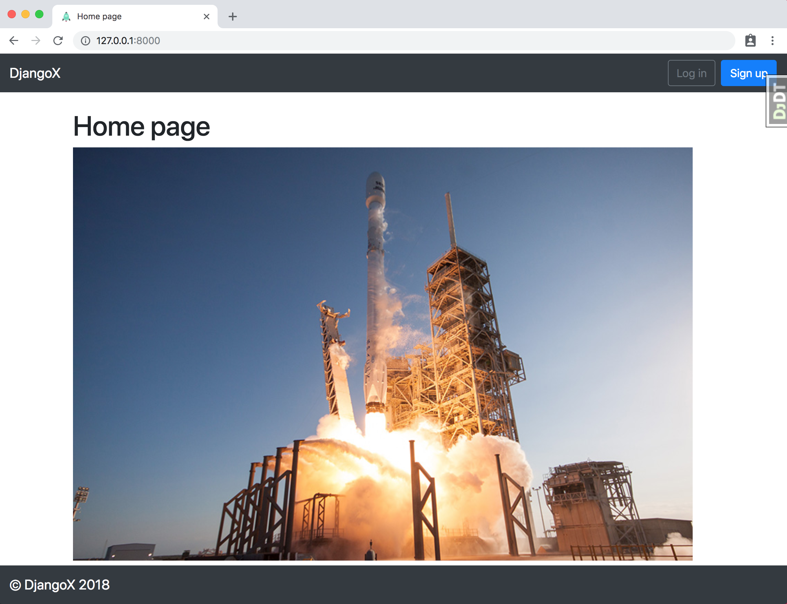
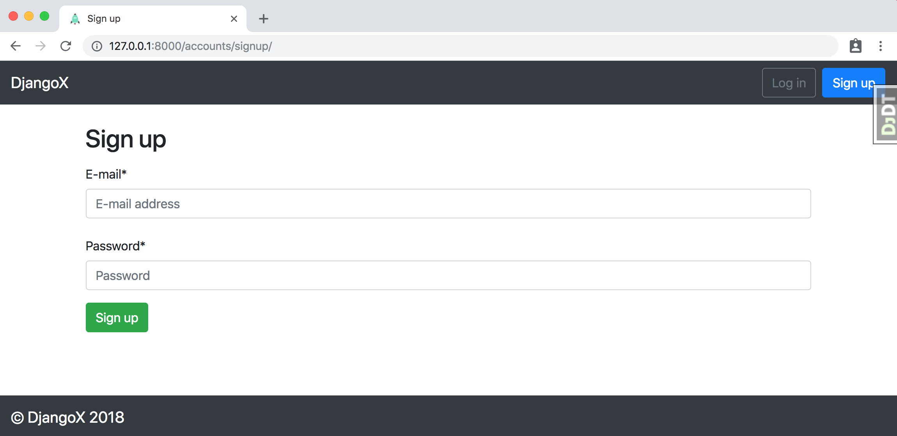
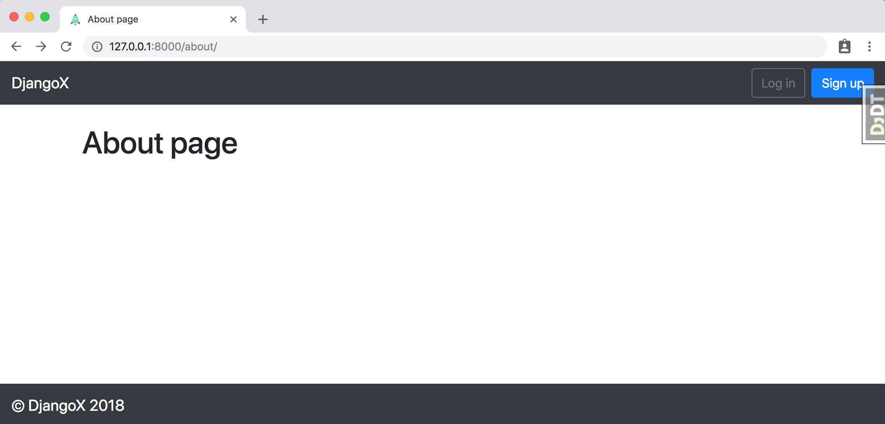
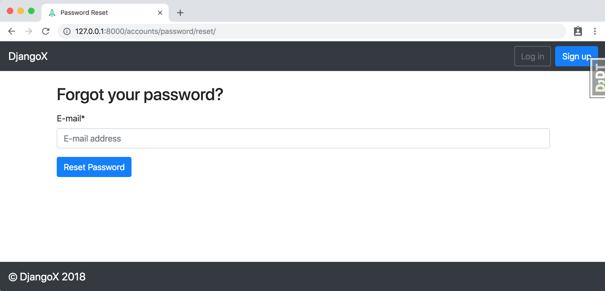

Разработать веб приложение
Обязательные для использования технологии/библиотеки:
SQLite;
Flask или Django.
 
Дополнительные библиотеки по надобности.
 
Система должна позволять авторизовать пользователя.
Различать 2 роли:
Admin;
User.
Админ имеет возможность добавлять, изменять, удалять:
Пользователей;
Источники;
Документы.
Простой пользователь имеет доступ только к созданию документов. Редактировать документы может только на протяжении 1 часа с момента создания. Фиксировать количество операций редактирования.
У документа есть такие поля как:
Id;
title;
text;
url;
created - дата время, календарь с выбором даты и времени (дата которую задает пользователь);
Источник;
дата добавления (добавляется по умолчанию первый раз при создании);
updated (дата модификации);
user_id (пользователь добавивший документ).
 
Поиск документов должен выполняться с помощью таких фильтров по таким полям:
source;
created;
user (пользователь добавивший документ);
updated;
title;
text.
 
Описание типа Источник
id;
sid (дополнительный строковый id);
name;
url.
Пользователь
id;
username;
email;
password;
active;
role;
дополнительные сопутствующие поля если нужно (например, с какого ip последний раз заходил).
Когда пользователь добавляет документ, он попадает в SQLite базу.
У администратора есть отдельный функционал:
выгрузить все (отобранные по фильтру) документы в jsonl формате в файл (отдать данные пользователю через браузер)
выгрузить данные через celery task и положить в виде файла где-то рядом с системой.
 
Будет плюсом:
Обеспечение уникальности документа в базе данных по таким параметрам как title и text;
Выбор источника при добавлении/редактировании документа должен осуществляться через селектор с фильтрацией на backend стороне, т.к. источников может быть свыше 100 тысяч элементов.  Например, пользователь ввел 2 символа, отправился запрос на backend и возвратился список с элементами соответствующие запросу и отобразились пользователю для выбора.


# repack of DjangoX

A framework for launching new Django projects quickly. Comes with a complete user authentication flow, custom user model, and social authentication options via Gmail, Facebook, Twitter, etc.

> **NOTE**: This open source project is supported by my two published books [Django for Beginners](https://djangoforbeginners.com/) and [REST APIs with Django](https://restapiswithdjango.com). Both of which have the first few chapters available for free online. Please take a look!

## Features

- For Django 2.1 and Python 3.5
- Modern virtual environments with [pipenv](https://github.com/pypa/pipenv)
- Styling with [Bootstrap](https://github.com/twbs/bootstrap) v4.1.3
- Custom user model
- Email/password for log in/sign up instead of Django's default username/email/password pattern
- Social authentication via [django-allauth](https://github.com/pennersr/django-allauth)
- [django-debug-toolbar](https://github.com/jazzband/django-debug-toolbar)

## First-time setup

1.  Make sure Pipenv are already installed. [See here for help](https://djangoforbeginners.com/initial-setup/).
2.  Clone the repo and configure the virtualenv:

```
$ git clone https://github.com/wsvincent/djangox.git
$ cd djangox
$ pipenv install
$ pipenv shell
```

3.  Set up the initial migration for our custom user models in `users` and build the database.

```
(djangox) $ python manage.py makemigrations users
(djangox) $ python manage.py migrate
```

4.  Create a superuser:

```
(djangox) $ python manage.py createsuperuser
```

5.  Confirm everything is working:

```
(djangox) $ python manage.py runserver
```

Load the site at [http://127.0.0.1:8000](http://127.0.0.1:8000).





<!-- 



 -->

## Next Steps

- Use [PostgreSQL locally via Docker](https://wsvincent.com/django-docker-postgresql/)
- Use [django-environ](https://github.com/joke2k/django-environ) for environment variables
- Update [EMAIL_BACKEND](https://docs.djangoproject.com/en/2.0/topics/email/#module-django.core.mail) to configure an SMTP backend
- Make the [admin more secure](https://opensource.com/article/18/1/10-tips-making-django-admin-more-secure)

## Adding Social Authentication

- [Configuring Google](https://wsvincent.com/django-allauth-tutorial-custom-user-model/#google-credentials)
- [Configuring Facebook](http://www.sarahhagstrom.com/2013/09/the-missing-django-allauth-tutorial/#Create_and_configure_a_Facebook_app)
- [Configuring Github](https://wsvincent.com/django-allauth-tutorial/)
- `django-allauth` supports [many, many other providers in the official docs](https://django-allauth.readthedocs.io/en/latest/providers.html)
